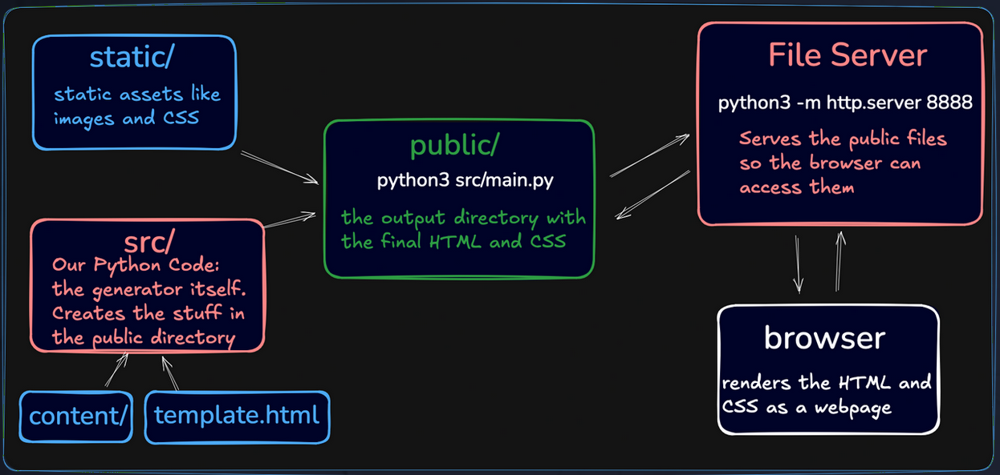

# Architecture

## The flow of data through the full system is

1. Markdown files are in the **/content** directory. A `template.html` file is in the root of the project.
2. The static site generator (the Python code in **src/**) reads the Markdown files and the template file.
3. The generator converts the Markdown files to a final HTML file for each page and writes them to the **/public** directory.
4. We start the built-in **Python HTTP server** (a separate program, unrelated to the generator) to serve the contents of the **/public** directory on <http://localhost:8888> (our local machine).
5. We open a browser and navigate to <http://localhost:8888> to view the rendered site.

## How the SSG Works

The vast majority of our coding will happen in the **src/** directory because almost all of the work is done in steps 2 and 3 above. Here's a rough outline of what the final program will do when it runs:

1. Delete everything in the **/public** directory.
2. Copy any static assets (HTML template, images, CSS, etc.) to the **/public** directory.
3. Generate an HTML file for each Markdown file in the **/content** directory. For each Markdown file:
    1. Open the file and read its contents.
    2. Split the markdown into "blocks" (e.g. paragraphs, headings, lists, etc.).
    3. Convert each block into a tree of **HTMLNode** objects. For inline elements (like bold text, links, etc.) we will convert:
       - Raw markdown -> TextNode -> HTMLNode
    4. Join all the HTMLNode blocks under one large parent HTMLNode for the pages.
    5. Use a recursive **to_html()** method to convert the HTMLNode and all its nested nodes to a giant HTML string and inject it in the HTML template.
    6. Write the full HTML string to a file for that page in the **/public** directory.

## How We're Gonna Build It

We're not going to build the program in the same order that it runs... that's often not the best way to build large projects. Instead, we'll tackle individual problems that we know we'll need to solve and use unit tests to make sure they work as expected. Then we'll put the pieces together into a working program as we get closer to the end.

You don't need to memorize the information on this page, but come back to review it if you ever feel lost in the details.
